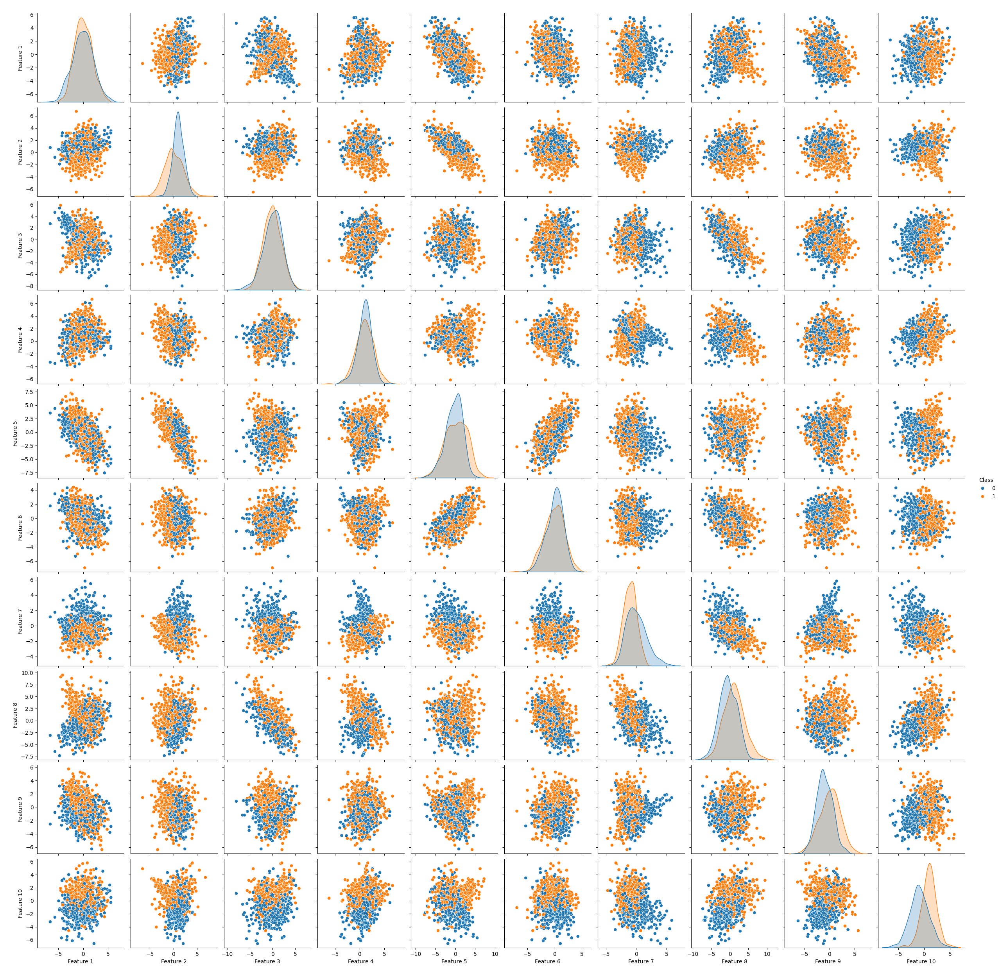
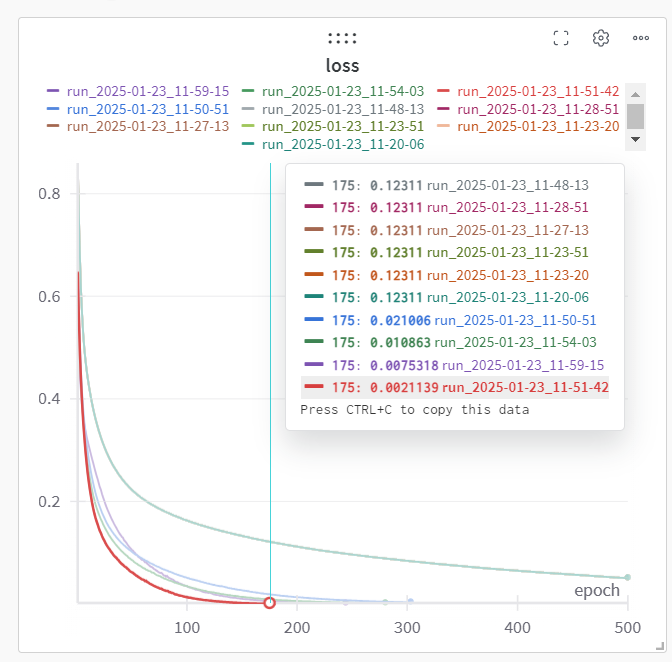
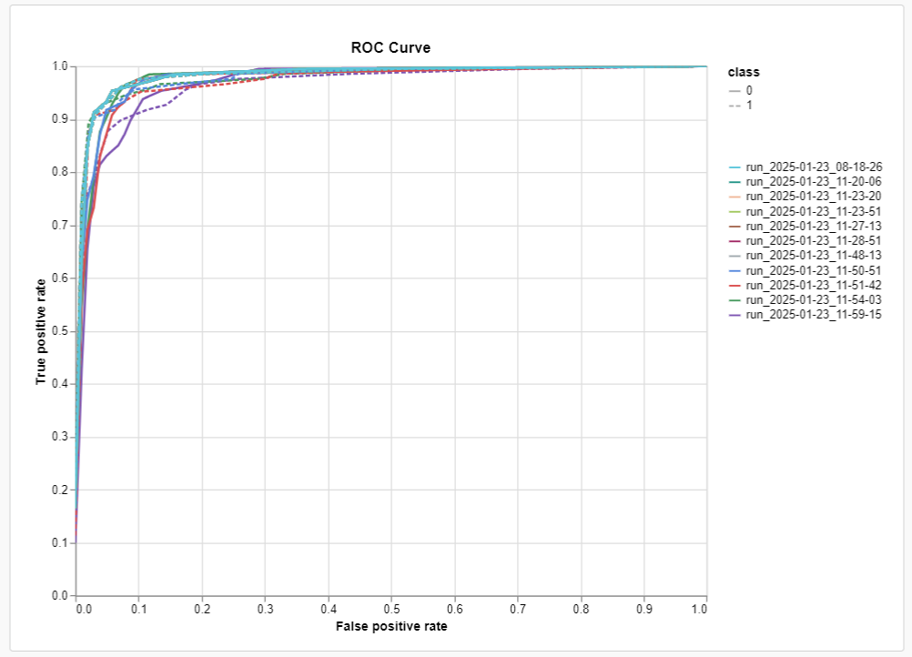
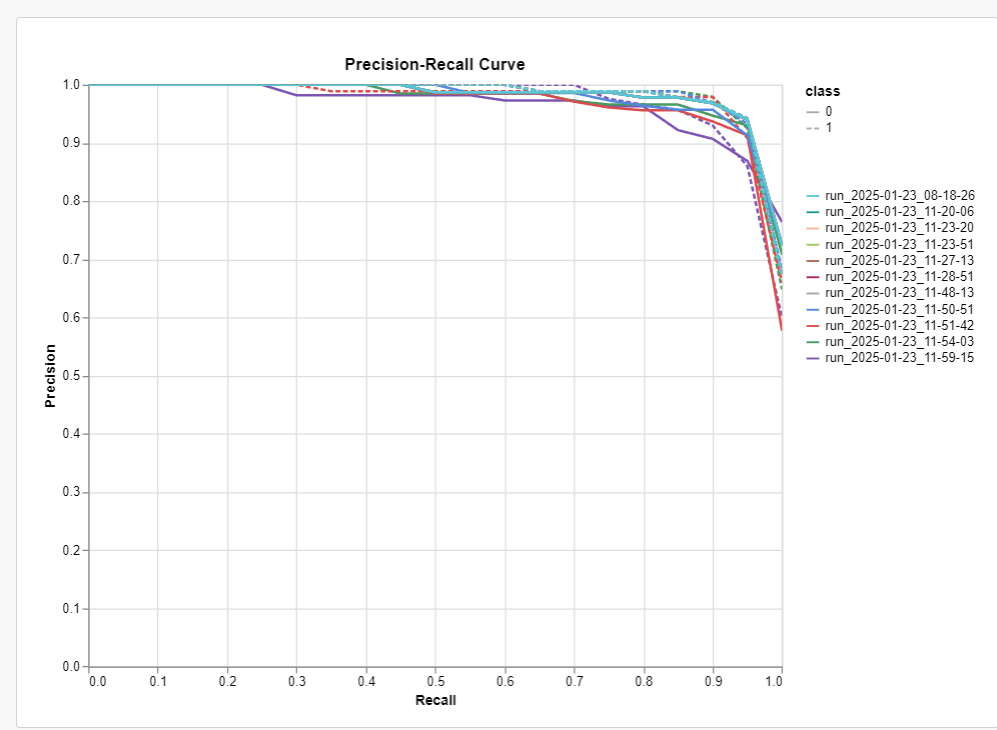
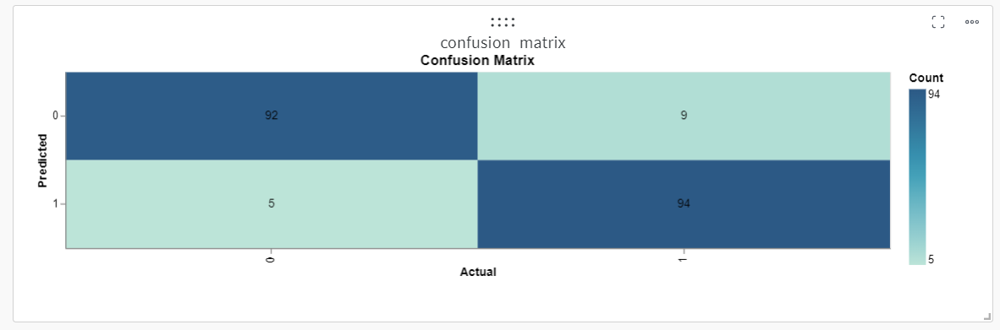
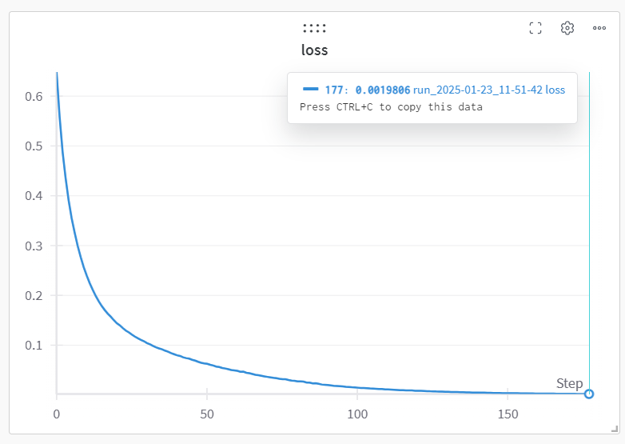
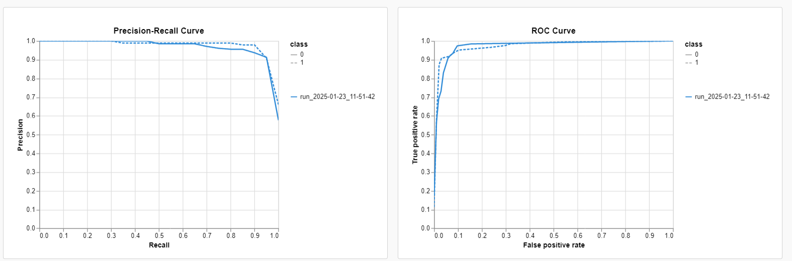
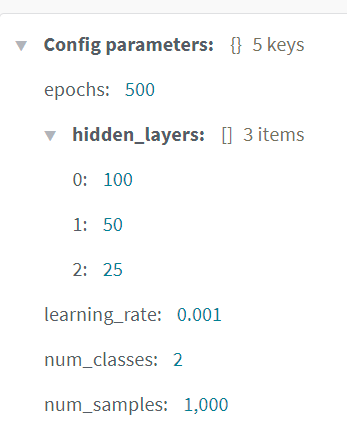
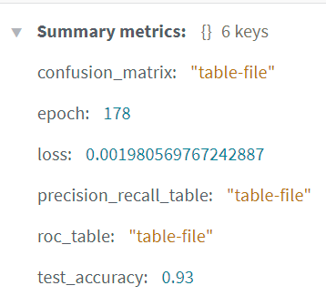

# Classification Project: Multi-Layer Perceptron (MLP) Classifier

This project demonstrates a classification task using scikit-learn's `MLPClassifier`. The objective is to build a neural network to classify data generated with `make_classification` and analyze its performance through various metrics and visualizations.

---

## **Project Requirements**

### **Dependencies**
Install the required Python libraries:
```bash
pip install numpy matplotlib seaborn pandas scikit-learn wandb
```

---

## **How to Run**

### **Training Script**
1. Run the training script to:
   - Train the model.
   - Generate visualizations.
   - Save the trained model.

```bash
python main.py
```

2. The script will generate the following:
   - **Plots**:
     - Pair plot: `pairplot-<timestamp>.png`
   - **Trained Model**:
     - File: `mlp_classifier-<timestamp>.joblib`

---

### **Prediction Script**
Use the saved model to make predictions:
```bash
python predict.py
```
- Enter the path of the saved model in the script.
- Provide feature inputs (10 values).

---

## **Results and Visualizations**

### **1. Generated Data Visualization**
- Pairwise scatter plots of features with class labels.
- File nomenclature: `pairplot-<timestamp>.png`.


### **2. Loss Curves**
- Shows how the loss decreases across epochs during training for many runs


### **3. ROC Curve**
- Visualizes the trade-off between true positive rate and false positive rate.


### **4. Precision-Recall Curve**
- Shows precision vs. recall for different thresholds.


### **5. Confusion Matrix**
- Displays true positives, false positives, true negatives, and false negatives.


## **6. Best and Fastest Result**
- Loss Function

- ROC and Precision-Recall Curves

- Configuration of the Best Model

- Summary from WandB (Test Accuracy)

---

## **Customizations and Experiments**

1. **Modify Hidden Layers**:
   - Change the `HIDDEN_LAYERS` parameter in `train_script.py` to experiment with different architectures.

2. **Experiment with Solvers**:
   - Try `solver='sgd'` or `solver='lbfgs'` for optimization.

3. **Change Activation Functions**:
   - Options: `relu`, `tanh`, or `logistic`.

4. **Adjust Learning Rate**:
   - Modify `LEARNING_RATE` in `train_script.py` to improve convergence.

---

## **References**
1. Scikit-learn documentation: https://scikit-learn.org
2. WandB documentation: https://docs.wandb.ai

---

